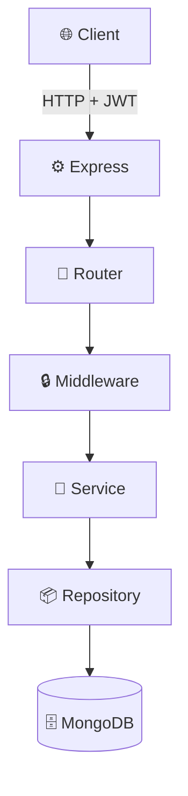

# 📝 SimpleBoard_Server

Node.js + Express + MongoDB 기반의 게시판 백엔드 API 서버

## 🏗️ 시스템 아키텍처



## 🚀 주요 기능

- ✅ JWT 기반 사용자 인증
- ✅ 게시글 CRUD (작성, 조회, 수정, 삭제)
- ✅ 사용자별 / 닉네임별 게시글 검색
- ✅ bcrypt 비밀번호 암호화
- ✅ Express Validator를 통한 입력 검증

## 📦 기술 스택

| 카테고리 | 기술 |
|---------|------|
| **Runtime** | Node.js |
| **Framework** | Express 5.x |
| **Database** | MongoDB 7.x |
| **Authentication** | JWT (jsonwebtoken) |
| **Validation** | express-validator |
| **Password** | bcrypt |

## 🛠️ 설치 및 실행

### 1️⃣ 사전 요구사항

- Node.js 18 이상
- MongoDB 7.x (로컬 또는 MongoDB Atlas)

### 2️⃣ 설치

```bash
# 저장소 클론
git clone https://github.com/LeF-0213/SimpleBoard_Server.git
cd SimpleBoard_Server

# 패키지 설치
npm install
```

### 3️⃣ 환경 변수 설정

프로젝트 루트에 `.env` 파일 생성:

```env
# MongoDB 연결
DB_HOST=mongodb://localhost:27017/board

# JWT 설정
JWT_SECRET_KEY=your-super-secret-key-here
JWT_EXPIRES_SEC=604800

# Bcrypt
BCRYPT_SALT_ROUNDS=10

# 서버 포트
HOST_PORT=8080
```

### 4️⃣ 실행

```bash
# 개발 모드 (nodemon)
npm run dev

# 일반 실행
node app.mjs
```

서버가 `http://localhost:8080`에서 실행됩니다.

## 📡 API 엔드포인트

### 🔐 인증 (Authentication)

| Method | Endpoint | 설명 | 인증 필요 |
|--------|----------|------|-----------|
| POST | `/auth/signup` | 회원가입 | ❌ |
| POST | `/auth/login` | 로그인 | ❌ |
| POST | `/auth/me` | 로그인 상태 확인 | ✅ |

**회원가입 요청 예시:**

```json
{
  "userid": "gumayusi",
  "password": "password1234",
  "nickname": "마구유시",
  "email": "gumayusi@example.com"
}
```

**로그인 응답 예시:**

```json
{
  "token": "eyJhbGciOiJIUzI1NiIsInR5cCI6IkpXVCJ9...",
  "user": {
    "id": "507f1f77bcf86cd799439011",
    "userid": "gumayusi",
    "nickname": "마구유시"
  }
}
```

### 📝 게시글 (Posts)

모든 게시글 API는 **JWT 토큰 필수**입니다.

| Method | Endpoint | 설명 | 권한 |
|--------|----------|------|------|
| GET | `/post` | 전체 게시글 조회 | 로그인 |
| GET | `/post?search=검색어` | 게시글 검색 | 로그인 |
| GET | `/post/:id` | 특정 게시글 조회 | 로그인 |
| POST | `/post` | 게시글 작성 | 로그인 |
| PUT | `/post/:id` | 게시글 수정 | 작성자 |
| DELETE | `/post/:id` | 게시글 삭제 | 작성자 |

**게시글 작성 요청 예시:**

```json
{
  "title": "안녕하세요",
  "text": "첫 번째 게시글입니다."
}
```

**헤더:**

```
Authorization: Bearer {your-jwt-token}
```

## 🗂️ 프로젝트 구조

```
SimpleBoard_Server/
├── app.mjs                  # Express 앱 설정
├── config.mjs               # 환경 변수 설정
├── db/
│   └── database.mjs         # MongoDB 연결
├── middleware/
│   ├── auth.mjs             # JWT 인증 미들웨어
│   └── validator.mjs        # 유효성 검사 미들웨어
├── router/
│   ├── auth.mjs             # 인증 라우터
│   └── posts.mjs            # 게시글 라우터
├── service/
│   ├── auth.mjs             # 인증 비즈니스 로직
│   └── post.mjs             # 게시글 비즈니스 로직
├── repository/
│   ├── auth.mjs             # 사용자 DB 접근
│   └── post.mjs             # 게시글 DB 접근
├── package.json
└── .env                     # 환경 변수 (git에서 제외)
```

## 🔒 보안

- ✅ 비밀번호는 bcrypt로 해싱하여 저장
- ✅ JWT 토큰으로 인증 관리
- ✅ Express Validator로 입력 검증
- ✅ MongoDB Injection 방지

## 🧪 테스트

**Postman으로 API 테스트:**

## 🗄️ 데이터베이스 구조

### Users Collection

```javascript
{
  _id: ObjectId,
  userid: String,
  password: String,  // bcrypt 해싱
  nickname: String,
  email: String
}
```

### Posts Collection

```javascript
{
  _id: ObjectId,
  title: String,
  text: String,
  userid: String,
  nickname: String,
  idx: String,       // 작성자 ID
  createdAt: Date,
  updatedAt: Date
}
```

## 🔗 관련 저장소

- **프론트엔드**: [SimpleBoard_Client](https://github.com/LeF-0213/SimpleBoard_Client)
